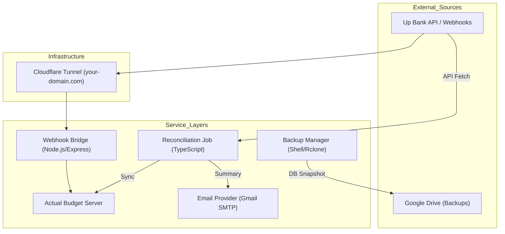

# 🌉 Actual Budget Bridge (Up Bank)

[]()
[]()
[]()

A high-performance bridge that connects your banking life to [Actual Budget](https://actualbudget.com/). This project automatically imports transactions from **Up Bank** in real-time, ensures data consistency via automated reconciliation, and maintains secondary backups to Google Drive.

---

## 🌟 Why this project exists?
Tracking expenses manually is tedious. Banking APIs are often fragmented. This bridge acts as the "glue" that:
- **Ensures Real-Time Accuracy**: Transactions appear in your budget seconds after you swipe your card.
- **Eliminates Human Error**: No more missed coffee transactions or manual entry typos.
- **Provides Resilience**: Daily 3 AM backups and 6 AM reconciliations ensure your data is always safe and perfectly in sync with your bank.

---

## 🏗️ System Architecture



---

## 🚀 Getting Started (Setup for Forking)

If you've forked this repo, follow these steps to get your own automated budget bridge running.

### 1. Prerequisites
- **Node.js** (v18+)
- **Actual Budget Server** (Self-hosted)
- **Rclone** (For backups)
- **Cloudflare Tunnel** (For secure internet access)

### 2. Credential Acquisition

You will need to gather the following keys and IDs:

#### Up Bank
1. Go to [api.up.com.au](https://api.up.com.au) and generate a **Personal Access Token**.
2. Save this as `UPBANK_APIKEY`.

#### Actual Budget
1. Open your Actual Budget in a browser.
2. The **Budget ID** is the long string in the URL after `/p/`.
3. Ensure your server is reachable (e.g., `http://localhost:5006`).

#### Internal Security
1. Generate a random secure string (e.g., `openssl rand -hex 32`).
2. Save this as `INTERNAL_API_KEY`. This protects your bridge from unauthorized POST requests.

### 3. Environment Configuration

Create a file at `secrets/secrets.sh`. **Never commit this file.**

```bash
# Banking API Keys
export UPBANK_APIKEY="up:yeah:your_key_here"
export UPBANK_WEBHOOK_SECRET="your_webhook_secret" # Get this after registering webhook

# Actual Budget Config
export ACTUAL_SERVER_URL="http://localhost:5006"
export ACTUAL_BUDGET_ID="your_budget_id"
export ACTUAL_PASSWORD="your_actual_password"

# Security
export INTERNAL_API_KEY="your_secure_random_key"

# Email Notifications (Gmail)
export EMAIL_FROM="user@example.com"
export EMAIL_TO="recipient@example.com"
export SMTP_USER="user@gmail.com"
export SMTP_PASS="your_gmail_app_password"
```

Then, run `./secrets/secrets.sh` to load them into your environment, or use `dotenv` via the `./env/.env` file.

### 4. Account Mapping

You must tell the bridge which bank account belongs to which Actual Budget account. 
Edit [**src/account-maps.ts**](src/account-maps.ts) and add your UUIDs:

```typescript
export const UP_BANK_ACCOUNT_MAP = {
    "UP_ACCOUNT_UUID": "ACTUAL_BUDGET_ACCOUNT_UUID"
};
```

---

## 🛠️ Usage

### Webhook Server
Starts the Express server to listen for real-time bank events.
```bash
npm run build
npm start # runs dist/server.js
```

### Manual Reconciliation
Compares your Up Bank history (last month) with Actual Budget and auto-fixes any missing entries.
```bash
./src/scripts/reconcile.sh
```

### Full Historical Reconciliation
Performs a deep audit of your **entire** transaction history (since account opening) to identify balance discrepancies, amount mismatches, manual entries, and implied starting balance gaps. This is a read-only diagnostic tool — it does not import or modify any data.
```bash
npm run build
node dist/scripts/reconcile-full.js
```
Output is written to `logs/reconcile-full.log`.

### Automated Backups
Compresses your Actual Budget SQLite database and uploads it to Google Drive.
```bash
./src/scripts/backup-actual.sh
```

### ✉️ Email Notifications
The reconciliation job automatically sends a summary email to your configured `EMAIL_TO` address. 

**Setup for Gmail:**
1. Enable **2-Step Verification** on your Google Account.
2. Generate an **App Password** (Security > App passwords).
3. Add the 16-character password to `SMTP_PASS` in your `.env` or `secrets.sh`.

---

## 🤖 Linux Automation (systemd)

For a truly "set and forget" experience, this project includes systemd configuration files in the [**systemd_setup/**](systemd_setup/) folder. These ensure the bridge and its dependencies start automatically on boot and run reliably in the background.

| File | Purpose |
| :--- | :--- |
| [MJ_upbank-webhook.service](systemd_setup/MJ_upbank-webhook.service) | Keeps the Node.js bridge server running 24/7 on port 8080. |
| [MJ_actual-server.service](systemd_setup/MJ_actual-server.service) | Managed service for the Actual Budget server instance. |
| [MJ_actual-timer.timer](systemd_setup/MJ_actual-timer.timer) | Triggers the daily Google Drive backup every morning at 3:00 AM. |
| [MJ_actual-backup.service](systemd_setup/MJ_actual-backup.service) | The underlying service that executes the backup script when triggered by the timer. |

For detailed installation instructions, see the [**systemd_setup/SYSTEMD_SETUP.md**](systemd_setup/SYSTEMD_SETUP.md) guide.

---

## 🛡️ Security & Hardening
- **Signature Verification**: Every Up Bank webhook is verified using HMAC-SHA256 to ensure it actually came from Up.
- **Cloudflare Tunneling**: No open ports are required on your router.
- **Rclone Isolation**: Uses the `drive.file` scope to limit backup access to only the files created by the bridge.

---

## 📄 License
This project is licensed under the MIT License - see the LICENSE file for details.
